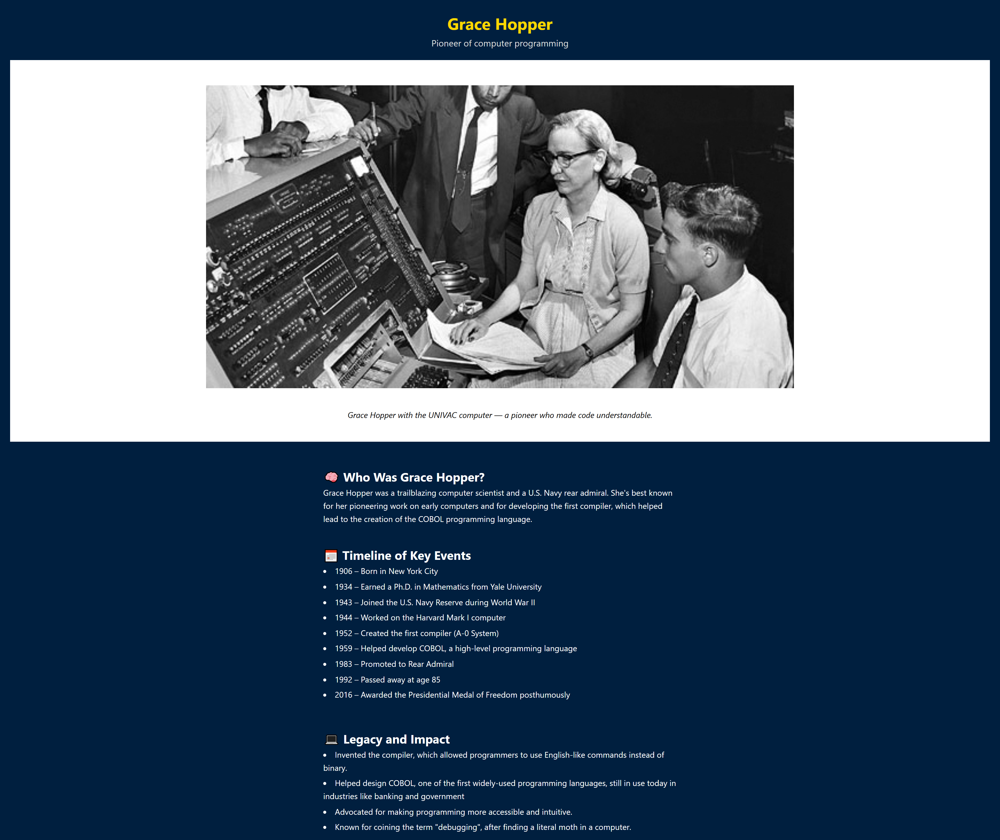

# Grace Hopper Tribute Page

A tribute to Grace Hopper, a pioneer in computer science and one of the first programmers of the Harvard Mark I computer.

## 🌟 Overview

This is a simple, responsive web page built using **HTML** and **CSS**. It highlights key moments in Grace Hopper's life and honors her contributions to the field of technology.

## 🔧 Tech Used

- HTML5  
- CSS3 (with Flexbox)

## 💡 Features

- Responsive layout (works on mobile and desktop)
- Clean and readable design
- Flexbox-based structure

## 📸 Preview




## 🔗 Live Demo

👉 [View the Live Page](https://pada-m.github.io/grace-hopper-tribute/)

## 📁 How to Use

To view or modify the project locally:

```bash
git clone https://github.com/yourusername/grace-hopper-tribute.git
cd grace-hopper-tribute
open index.html
```

## ✍️ Author

Created by Pada Mayer (https://github.com/Pada-M)
This was part of a web development practice project.
